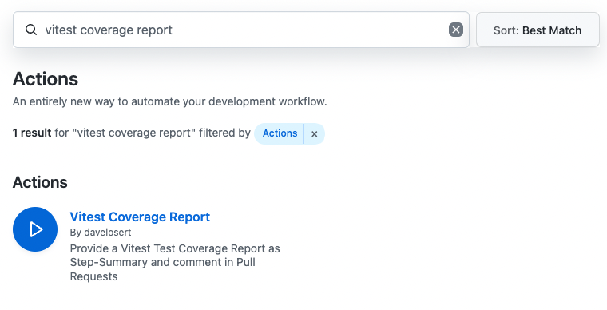
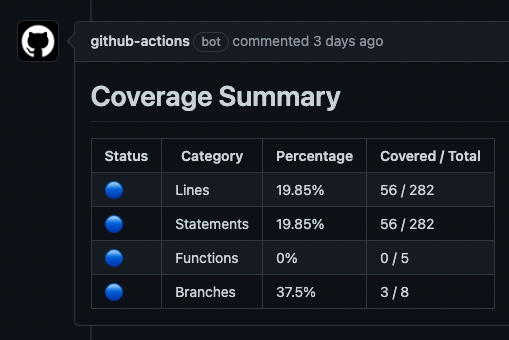
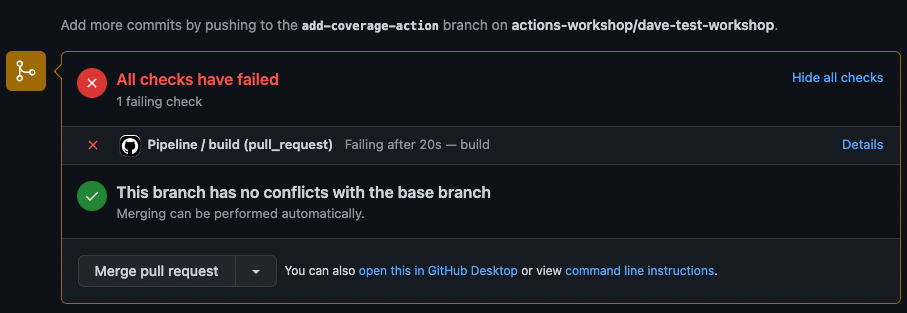
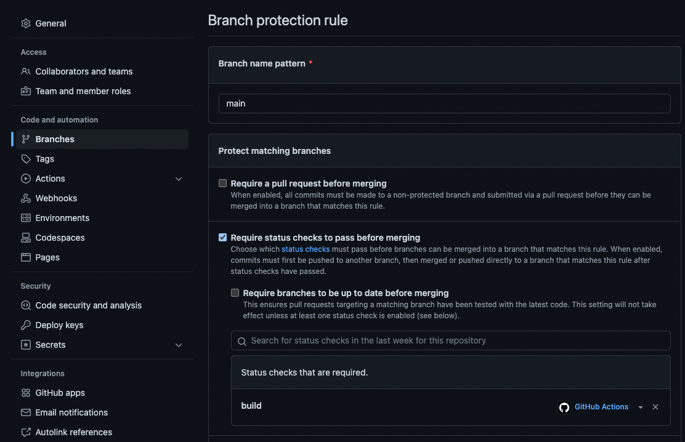
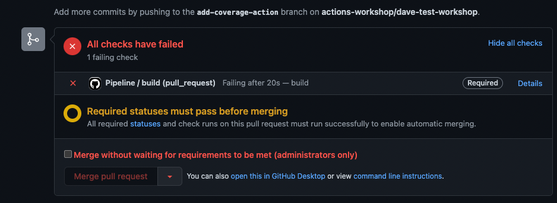

# Quality Assurance and Tests

## 1 - Add code coverage to your workflow

When setting up CI for your project, it's common to provide additional information to users, such as code coverage stats for the project's tests.

Doing that is straightforward with GitHub Actions. You determine where and when a specific task should occur, and then search for an appropriate action in the [GitHub Marketplace](https://github.com/marketplace?category=&query=&type=actions&verification=).

### 1.1 - Find an action in the marketplace

1. Search for an Action in the GitHub Marketplace:  `vitest coverage report`
  

2. Click on the **Vitest Coverage Report** action.

3. Read the provided documentation and incorporate the action into your workflow.

### 1.2 - Update the worklow

1. In the `main` branch, create the CI workflow `.github/workflows/pull_request.yml`

2. We will now build and test the application on every pull_request to `main` and display the test coverage.
3. This configuration does not apply on push to `main`, therefore we will not be packaging and push the application needlessly.

```yml
name: Pull Requests

on:
  pull_request:
    branches: [ main ]
  workflow_dispatch:

jobs:
  build:
    name: Build and Test
    runs-on: ubuntu-latest
    permissions:
      contents: read
      pull-requests: write
    steps:
    - uses: actions/checkout@v3
    - name: Use Node.js 20.x
      uses: actions/setup-node@v3
      with:
        node-version: 20.x
        cache: npm
    - run: npm ci
    - run: npm run build --if-present
    - run: npm test
    - name: 'Report Coverage'
      uses:  davelosert/vitest-coverage-report-action@v2
```

### 1.3 - Create a new pull request

1. Go to the main page of the repository.

2. Click on [`./src/main.tsx`](../src/main.tsx), and edit the file (for instance, add a comment).

3. Scroll down and click **Create a new branch for this commit and start a pull request**.

4. Click **Propose changes**.

5. Click **Create pull request**.

6. Wait for the CI workflow to run, and you will see a new comment in your pull request with the code coverage.


### 1.4. (Optional) - Enforce a certain coverage threshold with Branch Protection rules

As you can see, the test coverage of this project is quite low. Sometimes, we want to enforce a certain level of coverage on a project. This means that we would not allow merging a PR if it reduces the coverage below a certain threshold.

Let's try that out in this project:

1. On the branch you created earlier, navigate to the [`vite.config.ts`](../vite.config.ts) file (located at the root level of the repository). Within the `test.coverage` section, edit it to establish some thresholds like this:

    ```typescript
    coverage: {
      reporter: ["text", "json", "json-summary"],
      lines: 100,
      branches: 100,
      functions: 100,
      statements: 100
    },
    ```

2. With the coverage thresholds set, our workflow will now fail after the next commit on the `npm test` step. However, since we still want to report the coverage, we need to run the `vitest-coverage-report-action` even if the previous step fails. We can do this by adding an `if: always()` statement to the step:

      ```yml
      - name: 'Report Coverage'
        uses:  davelosert/vitest-coverage-report-action@v2
        if: always()
      ```

3. Commit the changes and wait for the workflow to run.

The `coverage` step should now fail. However, this does not yet prevent you from merging this PR. The merge button is still clickable:



To make this work, we need to set our target branch `main` as a protected branch and enforce that the `build` workflow be successful before a merge can be executed:

1. Within your repository, go to **Settings** and then to **Branches**.

2. Under **Branch protection rules**, click on **Add branch protection rule**.

3. For the **Branch name pattern**, type `main`.

4. Check the **Require status checks to pass before merging** box.

5. In the search box that will appear, look for `Build and Test` (or whatever name you chose for the job in step 3.3) and select that job. *(Note that you might also see the jobs of the previous matrix builds with specific Node versions. You can ignore these.)*
    

6. Scroll down and click `Create`.

If you now return to the PR, you will see that the merge button is inactive and can't be clicked anymore.



As an administrator, you still have the option to force a merge. Regular users in your repo won't have this privilege.

> **Note**
> This will now prevent people from merging a branch to `main` not only if the coverage thresholds are not met, but also if the entire workflow fails for other reasons. For example, if the build isn't working anymore or if the tests are generally failing - which usually is a desired outcome.

From here, you have two options:

1. Write more tests (if you're into React 😉)
2. Remove the (admittedly stringent) thresholds or lower them to make the workflow pass

## Conclusion

In this lab, you have learned how to:

- 👍 Add a new action to your workflow.
- 👍 (optionally) Prevent merges on failing tests or coverage thresholds using Branch Protection rules.

---